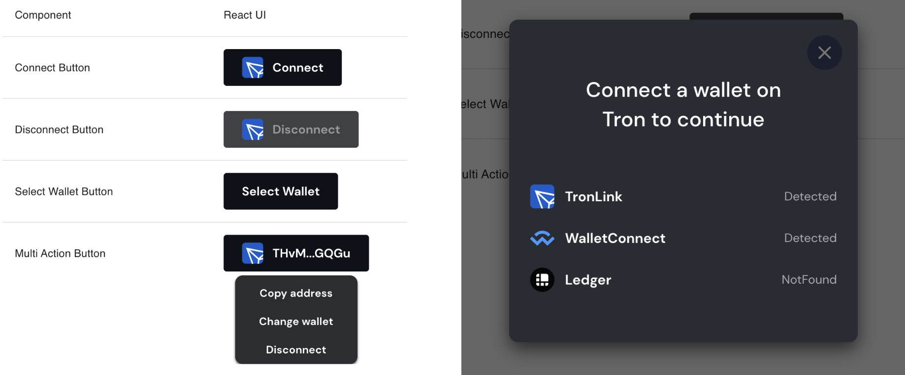

# tronwallet-adapter

This repository contains wallet adapters and components for Tron DApps. With out-of-box components and unified methods, developers can easily interact with multiple wallets, `select/connect/disconnect` wallets and sign a message or transaction.

## Wallet Integrations

### Supported

-   [TronLink App](https://www.tronlink.org/): All versions
-   [TronLink Extension](https://www.tronlink.org/): All versions
-   [BitKeep App](https://bitkeep.com/): All versions
-   [BitKeep Extension](https://bitkeep.com/): All versions
-   [OkxWallet App](https://okx.com/): Android all versions
-   [OkxWallet Extension](https://okx.com/): All versions
-   [TokenPocket App](https://www.tokenpocket.pro/): All versions
-   [Ledger](https://www.ledger.com/): All versions
-   [WalletConnect](https://walletconnect.org): `v2.0`

### Coming Soon

-   [imToken](https://token.im/)

## Introduction

### Adapters

Wallet adapters help you to access to TRON wallets with consistent API.

There are many wallets supporting TRON network such as TronLink, Ledger and so on . **Different wallets** and **different versions** of one wallet may have different interface to use. The aim of **Adapters** relavant pacakges is to shield these differences and offer consistent interface for DApp developers. DApps don't need to change their code frequently if they have accessed to the tron wallet dapters code.

For example if you want to connect to different wallets, you have to use different methods:

```js
// TronLink
window.tronLink.request({ method: 'tron_requestAccounts' });

// Ledger
const transport = await TransportWebHID.create();
const app = new Trx(transport);

// WalletConnect
const wallet = new WalletConnectWallet({
    network: this._config.network,
    options: this._config.options,
});
```

With adapter, you can use consistent APIs for different wallets:

```js
// TronLink
const tronlinkAdapter = new TronLinkAdapter();
await tronlinkAdapter.connect();
await tronlinkAdapter.signMessage(message);

// Ledger
const ledgerAdapter = new LedgerAdapter();
await ledgerAdapter.connect();
await ledgerAdapter.signMessage(message);

// WalletConnect
const walletconnectAdapter = new WalletConnectAdapter();
await walletconnectAdapter.connect();
await walletconnectAdapter.signMessage(message);
```

### React Hooks

React hook is a hook to manage the global state of wallet, such as current selected wallet and the connect state, address, and so on. It also provides some methods to interact with wallet.

When your dapp supports multiple wallets, with the help of `useWallet()` hook you can easily:

-   select which wallet to use
-   connect to the selected wallet
-   disconnect to the selected wallet
-   call `signMessage` or `signTransaction` of the selected wallet

Examples:

```jsx
function Comp() {
    const { wallet, address, connected, select, connect, disconnect, signMessage, signTransaction } = useWallet();
    return (
        <div>
            <button onClick={() => select('TronLink')}>Select Wallet</button>
            <button onClick={connect}>Connect</button>
            <button onClick={disconnect}>Disconnect</button>
            <button onClick={() => signMessage('Hello World')}>Sign Message</button>
        </div>
    );
}
```

### React UI Components

`useWallet()` only contains logic to manage wallet state. Besides, we provide a set of out-of-box components to help you interact with wallets:

-   `WalletSelectButton`: Show wallets dialog to select a wallet
-   `WalletConnectButton`: Connect to the selected wallet
-   `WalletDisconnectButton`: Disconnect to the selected wallet
-   `WalletActionButton`: A Button with multiple actions include `select/connect/disconnect`

Here is the demo image:



## Documentation

-   [For Tron Apps](./App.md)

For more details, please refer to the [API Documentation](https://developers.tron.network/docs/tronwallet-adapter).

## TronWallet Adapter Packages

This library is organized into several packages with few dependencies.

To add it to your app, you'll need abstract adapter package, some adapters for wallets, and UI components.

```bash
tronwallet-adapter
├─docs # documents
├─packages
|   ├─adapters
|   |   ├─abstract-adapter # abstract class for the specified adapter
|   |   ├─adapters # export all adapters
|   |   ├─tronlink # adapter for tronlink
|   |   ├─ledger # adapter for ledger
|   |   ├─walletconnect # adapter for walletconnect
|   |   ├─tokenpocket # adapter for TokenPocket
|   |   ├─bitkeep # adapter for BitKeep
|   |   ├─okxwallet # adapter for Okx Wallet
|   ├─react
|   |   ├─react-hooks # react hooks to manage wallet state
|   |   ├─react-ui # react ui components to select/connect wallets
├─demos
|   ├─react-ui
|   |   ├─create-react-app # demo created by create-react-app
|   |   ├─vite-app # demo for vitejs
|   |   ├─next-app # demo for nextjs
|   ├─dev-demo # demo for development
|   ├─cdn-demo # demo for cdn usage of adapters
```

### TronWallet Adapters

These packages provide adapters for each wallet.
You can use the `@tronweb3/tronwallet-adapters` package, or add the individual wallet packages you want.

| package                                     | description                                                      | npm                                                                                                                      |
| ------------------------------------------- | ---------------------------------------------------------------- | ------------------------------------------------------------------------------------------------------------------------ |
| adapters                                    | Includes all the wallets (with tree shaking)                     | [`@tronweb3/tronwallet-adapters`](https://www.npmjs.com/package/@tronweb3/tronwallet-adapters)                           |
| [tronlink](https://www.tronlink.org/)       | Adapter for TronLink extention and TronLink app(IOS and Android) | [`@tronweb3/tronwallet-adapter-tronlink`](https://www.npmjs.com/package/@tronweb3/tronwallet-adapter-tronlink)           |
| [ledger](https://www.ledger.com/)           | Adapter for Ledger                                               | [`@tronweb3/tronwallet-adapter-ledger`](https://www.npmjs.com/package/@tronweb3/tronwallet-adapter-ledger)               |
| [walletconnect](https://walletconnect.com/) | Adapter for Walletconnect                                        | [`@tronweb3/tronwallet-adapter-walletconnect`](https://www.npmjs.com/package/@tronweb3/tronwallet-adapter-walletconnect) |
| [tokenpocket](https://tokenpocket.pro/)     | Adapter for TokenPocket App(IOS and Android)                     | [`@tronweb3/tronwallet-adapter-tokenpocket`](https://www.npmjs.com/package/@tronweb3/tronwallet-adapter-tokenpocket)     |
| [bitkeep](https://bitkeep.com/)             | Adapter for BitKeep extension and BitKeep App(IOS and Android)   | [`@tronweb3/tronwallet-adapter-bitkeep`](https://www.npmjs.com/package/@tronweb3/tronwallet-adapter-bitkeep)             |
| [okxwallet](https://www.okx.com/)           | Adapter for Okx Wallet extension and App(Android)                | [`@tronweb3/tronwallet-adapter-okxwallet`](https://www.npmjs.com/package/@tronweb3/tronwallet-adapter-okxwallet)         |

### React Components

These packages provide components for react hooks context and custom react UI.

| package     | description                         | npm                                                                                                                  |
| ----------- | ----------------------------------- | -------------------------------------------------------------------------------------------------------------------- |
| react-hooks | provides a `useWallet()` react hook | [`@tronweb3/tronwallet-adapter-react-hooks`](https://www.npmjs.com/package/@tronweb3/tronwallet-adapter-react-hooks) |
| react-ui    | UI frameworks for react app         | [`@tronweb3/tronwallet-adapter-react-ui`](https://www.npmjs.com/package/@tronweb3/tronwallet-adapter-react-ui)       |

## Packages Examples

### @tronweb3/tronwallet-adapters

This package contains all wallet adapters for Tron including:

-   [TronLink](https://www.tronlink.org/).
-   [Ledger](https://www.ledger.com/).
-   [WalletConnect](https://walletconnect.org).
-   [TokenPocket](https://tokenpocket.pro/).
-   [BitKeep](https://bitkeep.com).
-   [Okx Wallet](https://okx.com).

Code example：

```jsx
import { TronLinkAdapter } from '@tronweb3/tronwallet-adapters';

function App() {
    const adapter = useMemo(() => new TronLinkAdapter(), []);
    const onConnect = useCallback(() => {}, []);
    const onDisconnect = useCallback(() => {}, []);
    const onStateChanged = useCallback(() => {}, []);
    useEffect(() => {
        adapter.on('connect', onConnect);
        adapter.on('disconnect', onDisconnect);
        adapter.on('stateChanged', onStateChanged);
        return () => {
            adapter.removeAllListeners();
        };
    });

    const connect = useCallback(() => adapter.connect(), []);
    const disconnect = useCallback(() => adapter.connect(), []);

    return <div></div>;
}
```

### @tronweb3/tronwallet-adapter-react-hooks

This package contains react hooks to easily `select/connect/disconnect` wallets and manage the wallet state.

Code example：

```jsx
import { WalletProvider, useWallet } from '@tronweb3/tronwallet-adapter-react-hooks';

function App() {
    const onError = useCallback((e) => {
        // handle error here
    }, []);
    return (
        <WalletProvider onError={onError}>
            <Content></Content>
        </WalletProvider>
    );
}
function Content() {
    const { address, wallet, connected, select, connect, disconnect } = useWallet();
    return (
        <div>
            <p>Current Address: {address}</p>
            <p>Connection Status: {wallet.state}</p>
            <button onClick={() => select('WalletAdapterName to be selected')}>Select Wallet</button>
            <button onClick={connect}>Connect</button>
            <button onClick={disconnect}>Disconnect</button>
        </div>
    );
}
```

### @tronweb3/tronwallet-adapter-react-ui

This package contains a set of out-of-the-box components to make it easy to `select/connect/disconnect` wallets.

Code example：

```jsx
import { WalletProvider } from '@tronweb3/tronwallet-adapter-react-hooks';
import { WalletModalProvider, WalletActionButton } from '@tronweb3/tronwallet-adapter-react-ui';
function App() {
    const onError = useCallback((e) => {
        // handle error here
    }, []);
    return (
        <WalletProvider onError={onError}>
            <WalletModalProvider>
                <WalletActionButton></WalletActionButton>
            </WalletModalProvider>
        </WalletProvider>
    );
}
```

## Quick Start

Clone this repo and run the following commands:

```bash
pnpm install
pnpm build
pnpm example
```

> As the repo uses `pnpm` to manage workspace, please install `Nodejs` and `pnpm` first.
> The following is required:
>
> -   Nodejs >= 16
> -   pnpm >= 7

## Which package should developers use ?

It's recommended to use `@tronweb3/tronwallet-adapter-react-hooks` or `@tronweb3/tronwallet-adapter-react-ui` for developing easily.

If you don't want to customize your UI components and just want to accomplish functions rapidly, you can use components of `@tronweb3/tronwallet-adapter-react-ui` such as `WalletActionButton`. Its out-of-the-box components will help you `select/connect` the wallet and manage the wallet state.

If you want to have different appearance by developing components, you can use `@tronweb3/tronwallet-adapter-react-hooks` and call the `useWallet()` hook to `select/connect` the wallet.

`@tronweb3/tronwallet-adapters` and `@tronweb3/tronwallet-adapter-xxx` packages include adapters for specified wallets. If you need only one adapter and want to custom your logic and style, you can choose this package.

## Contributing

Welcome to contribute your idea!

1. Fork the repo and clone to your device.
    ```bash
    git clone https://github.com/tronprotocol/tronwallet-adapter.git
    ```
2. Install Nodejs@16.x and pnpm@7.x
3. Install dependencies
    ```bash
    pnpm install
    ```
4. You can run `pnpm watch` to rebuild the code when changes.
5. Commit the changes you've made and open a PR to this repository.

### Release

1. first update package version:

```shell
pnpm update-version
```

2. release the packages

```
pnpm release
```

## License

[MIT](https://opensource.org/licenses/MIT)
