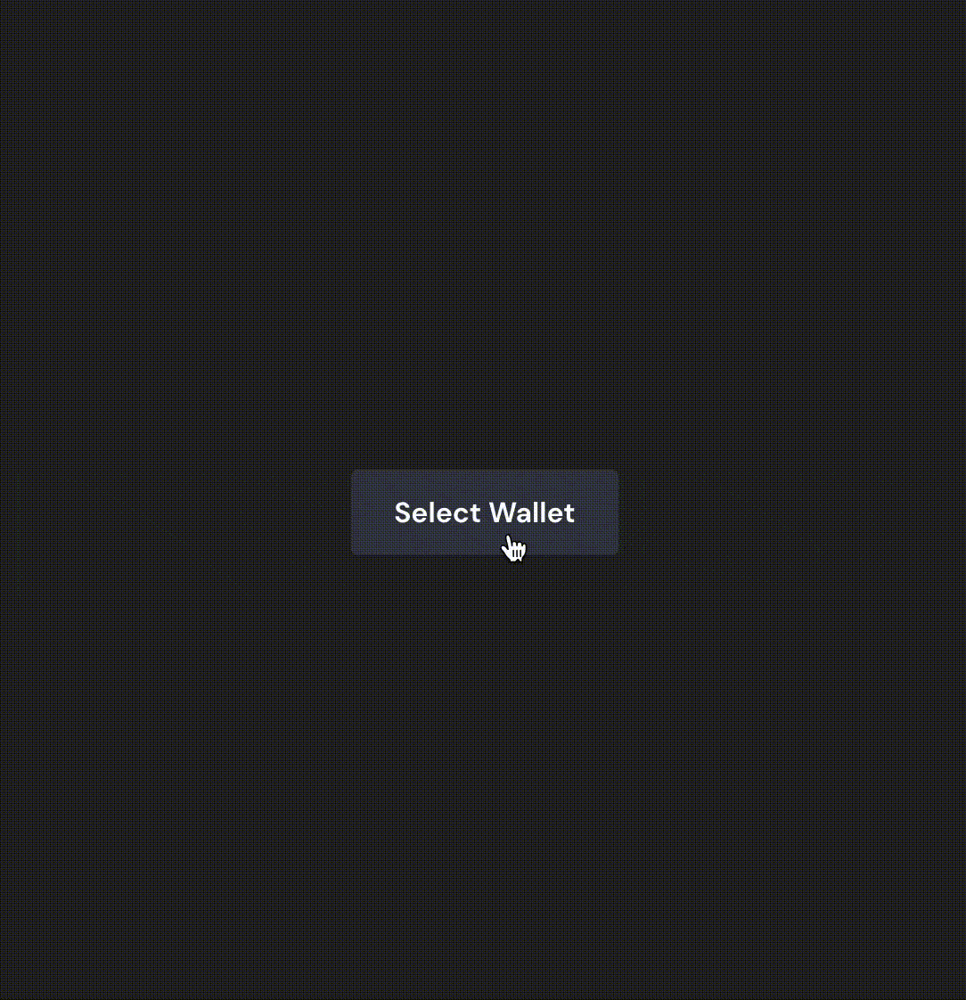

# @tronweb3/tronwallet-adapter-react-ui

`@tronweb3/tronwallet-adapter-react-ui` provides a set of out-of-the-box components to make it easy to select, change, connect and disconnect wallet.

`@tronweb3/tronwallet-adapter-react-ui` depends `@tronweb3/tronwallet-adapter-react-hooks` to work. So developers must wrap `App` content within the `WalletProvider`.

## Installation

```bash
npm install @tronweb3/tronwallet-adapter-react-ui @tronweb3/tronwallet-adapter-react-hooks @tronweb3/tronwallet-abstract-adapter @tronweb3/tronwallet-adapters

# or pnpm install @tronweb3/tronwallet-adapter-react-ui @tronweb3/tronwallet-adapter-react-hooks @tronweb3/tronwallet-abstract-adapter @tronweb3/tronwallet-adapters

# or yarn install @tronweb3/tronwallet-adapter-react-ui @tronweb3/tronwallet-adapter-react-hooks @tronweb3/tronwallet-abstract-adapter @tronweb3/tronwallet-adapters
```

## Usage

`@tronweb3/tronwallet-adapter-react-ui` provide a `Select Wallet Modal` by `Context.Provider`. So developers must wrap `App` content within the `WalletProvider` and `WalletModalProvider`.

```jsx
import { useWallet, WalletProvider } from '@tronweb3/tronwallet-adapter-react-hooks';
import { WalletModalProvider, WalletActionButton } from '@tronweb3/tronwallet-adapter-react-ui';
import { WalletDisconnectedError, WalletError, WalletNotFoundError } from '@tronweb3/tronwallet-abstract-adapter';
import toast, { Toaster } from 'react-hot-toast';

function App() {
    // here use `react-hot-toast` npm package to notify user what happened
    function onError(e: WalletError) {
        if (e instanceof WalletNotFoundError) {
            toast.error(e.message);
        } else if (e instanceof WalletDisconnectedError) {
            toast.error(e.message);
        } else toast.error(e.message);
    }
    return (
        <WalletProvider onError={onError}>
            <WalletModalProvider>
                <ConnectComponent></ConnectComponent>
                <Profile></Profile>
            </WalletModalProvider>
        </WalletProvider>
    );
}
function ConnectComponent() {
    const { connect, disconnect, select, connected } = useWallet();
    return <WalletActionButton></WalletActionButton>;
}
function Profile() {
    const { address, connected, wallet } = useWallet();
    return (
        <div>
            <p>
                <span>Connection Status:</span> {connected ? 'Connected' : 'Disconnected'}
            </p>
            <p>
                <span>Your selected Wallet:</span> {wallet?.adapter.name}
            </p>
            <p>
                <span>Your Address:</span> {address}
            </p>
        </div>
    );
}
```

## `WalletModalProvider` and `useWalletModal`

`WalletModalProvider` provide a `Select Wallet Modal` by `Context.Provider`. The modal can be controled by `useWalletModal`.

```jsx
function App() {
    const { visible, setVisible } = useWalletModal();
    function toggle() {
        setVisible((visible) => !visible);
    }
    return (
        <div>
            <button onClick={toggle}>{visible ? 'Close Modal' : 'Open Modal'}</button>
        </div>
    );
}
```

## `WalletConnectButton`

Button to connect to the selected wallet. The button is disabled when:

-   no wallet is selected
-   is connecting to wallet
-   is connected
-   disabled by props

### Props

```jsx
type ButtonProps = PropsWithChildren<{
    className?: string,
    disabled?: boolean,
    onClick?: (e: MouseEvent<HTMLButtonElement>) => void,
    style?: CSSProperties,
    tabIndex?: number,
    icon?: string,
}>;
```

## `WalletDisconnectButton`

Button to connect to the selected wallet. The button is disabled when:

-   no wallet is selected
-   is connecting to wallet
-   disabled by props

### Props

Same as `WalletConnectButton`.

## `WalletSelectButton`

Button to open `Select Wallet Modal`.

### Props

Same as `WalletConnectButton`.

## `WalletActionButton`

Button with multiple functions including:

-   Select wallet
-   Connect to wallet
-   Disconnect from wallet
-   Show current selected wallet and address
-   Copy address

It's recommended to use this component to connect wallet easily.


### Props

Same as `WalletConnectButton`.
